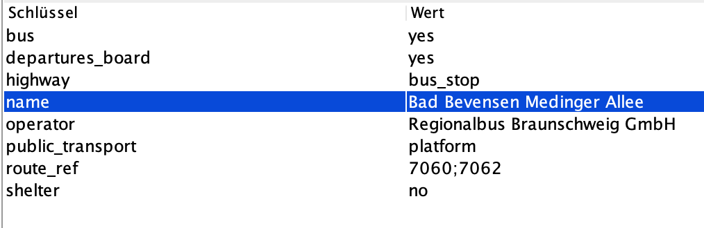

# Bürgerbus

Bürgerbus ist ÖPNV. 
Jeder kann damit fahren (öffentlich), es gibt einen festen Fahrplan und man löst ein Busticket, um damit zu fahren. Die Haltestellen sind genauso beschildert wie auch die anderer ÖPNV-Linien.

Der Unterschied zum 'normalen' ÖPNV ist, dass der Bürgerbus von ehrenamtlichen Bürgern/Fahrern gefahren wird. Deshalb werden in der Regel 9-Sitzer-Busse verwendet, damit die Fahrer keinen teuren Busführerschein brauchen. Offziell sollen BürgerBusse das bestehende ÖPNV-Netz ergänzen.

## HowTo:
Eine Übersicht über Schlüssel und Werte für das Mappen von öffentlichem Verkehr:
https://wiki.openstreetmap.org/wiki/DE:Öffentlicher_Verkehr#Busse

PTv2:

https://wiki.openstreetmap.org/wiki/Proposal:Public_Transport

### Haltestellen anlegen:

Haltestellen werden lt. PTv2 am einfachsten durch 2 Nodes/Punkte erfasst

#### Punkt auf der Straße, wo der Bus hält
- public_transport=stop_position
- bus=yes
- name=…

#### Punkt neben der Straße, wo das Haltestellenschild steht
- public_transport=platform
- highway=bus_stop
- name=…
- 
… und viele andere, optionale Dinge (dazu später mehr)

### Was passiert, wenn bereits eine Haltestelle (gleicher oder anderer `operator`) existiert?

Im Zweifel: 
Gibt es nur ein Haltestellenschild, so gibt es auch in OSM nur eine public_transport=platform. (In OSM gilt Allgemein: Ein Feature = ein OSM-Objekt)
https://community.openstreetmap.org/t/burgerbus-howto/101644/26

`operator` bezieht sich bei der Haltestelle darauf, wer das Haltestellenschild aufgestellt hat, wer die Reinigung bezahlt, wer die Pläne austauscht, … - **nicht**: wessen Busse hier halten.

### Wird eine Haltestelle, bei der auf beiden Seiten der Straße ein Haltestellenschild steht auch mit zwei Haltestellen-Nodes erfasst? 

oder

### Werden Haltestellen für beide Fahrtrichtungen separat erfasst?
Wenn sie direkt gegenüber (+/- 5m) sind, dann nehme ich nur eine public_transport=stop_position auf der Straße, aber dennoch 2 * public_transport=platform neben der Straße.

Dann kann jede public_transport=platform separat mit Attributen versehen werden: shelter=no, wenn auf dieser Straßenseite kein Häuschen steht.
https://community.openstreetmap.org/t/burgerbus/92656/22

‘route_ref’ = ‘210;211’ (z.B.) an stop_position und platform kann die hier haltenden Busse identifizieren

‘route_ref’, wenn gesetzt, muss dann aber alle hier haltenden Busse enthalten, auch die, die eine (PTv2-)Relation haben (wenn schon, denn schon: wenn gesetzt, dann korrekt und vollständig)

Problematisch bei gemeinsamer stop_position, wenn einer der Busse hier nur in einer Richtung hält

# Glossar:
- Bedarfshalt - An einer Bedarfshaltestelle muss der Bus vorher telefonisch angefordert werden. Es ist ein ähnliches Konzept wie im 'normalen' ÖPNV, welches sich dort Anruf-Linienfahrt nennt.
- 
- OpenStreetMap - OSM ist ein Projekt mit dem Ziel, frei zugängliche Karten für alle Arten der Anwendungen zur Verfügung zu stellen. Das Projekt wurde 2004 in Grossbrittannien gegründet.

Link-Sammlung:

### Busliniennetz im Landkreis Uelzen
https://www.hansestadt-uelzen.de/home/buerger-service/verkehr-parken/oepnv/busliniennetz-im-landkreis-uelzen.aspx

Frage: wo ist 7072?

### Liniennetz und Busfahrplan im Landkreis Uelzen
https://www.landkreis-uelzen.de/home/sicherheit-ordnung-und-verkehr/verkehr/bus-bahn-oepnv/Liniennetzundbusfahrplan-im-Landkreis-Uelzen.aspx

Frage: wo ist 7072?

## Informationen zu OpenStreetMap:

OpenStreetMap ist ein Projekt mit dem Ziel, frei zugängliche Karten für alle Arten der Anwendungen zur Verfügung zu stellen. Das Projekt wurde 2004 in Grossbrittannien gegründet.

OpenStreetMap setzt sich aus einer Vielzahl von Entwickler und 'Mappern' (diejenigen, die die Daten sammeln und erfassen) zusammen. Jeder kann mitmachen!

Die 'Mapper' (als Mitglieder von OpenStreetMap) sammeln weltweit Daten über Flüsse, Wälder, Häuser, Denkmäler sowie wichtige Daten mit Mobilitätsbezug wie etwa Straßen, Strecken des öffentlichen Nahverkehrs, Haltestellen oder sogar Tankstellen für E-Mobilität. 

Die Rechte an den Daten von OpenStreetMap fliessen in die OpenStreetMap-Stiftung ein. Die Kartendaten darf jeder, ob Privatleute, Vereine, Firmen oder Institutionen, lizenzkostenfrei einsetzen und weiterverarbeiten. Dies ist durch die Satzung der Stiftung hinter OpenStreetMap so festgelegt. Die so entstandenen freie Geodatenbank steht unter [www.openstreetmap.org](https://www.openstreetmap.org)  weltweit allen Menschen lizenzkostenfrei zur Verfügung -  auch zur kommerziellen Nutzung.

brew install java

java 11.0.8 2020-07-14 LTS
Java(TM) SE Runtime Environment 18.9 (build 11.0.8+10-LTS)
Java HotSpot(TM) 64-Bit Server VM 18.9 (build 11.0.8+10-LTS, mixed mode)
openjdk: 17.0.8

Fragen:
- Kann man einen Punkt an einer bestimmten Position (lat, lon) hinzufügen?
- Wenn man auf der Karte via 'Zu Position springen' die Ansicht einstellt, kann man da einen Kreis oder den Punkt (an den gesprungen wurde) anzeigen?
- Gibt es eine Möglichkeit, einen Punkt auf der Karte auszuwählen und dann per '+' Taste diesen einzoomen? (bei mir wird immer auf die Mitte des aktuellen Ausschnitts gezoomt)
- Kann man JOSM irgendwie beibringen seitlich zu scrollen (z.B. mit Trackpad oder der Apple Maus)?
